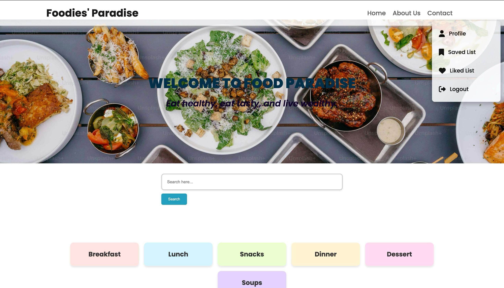
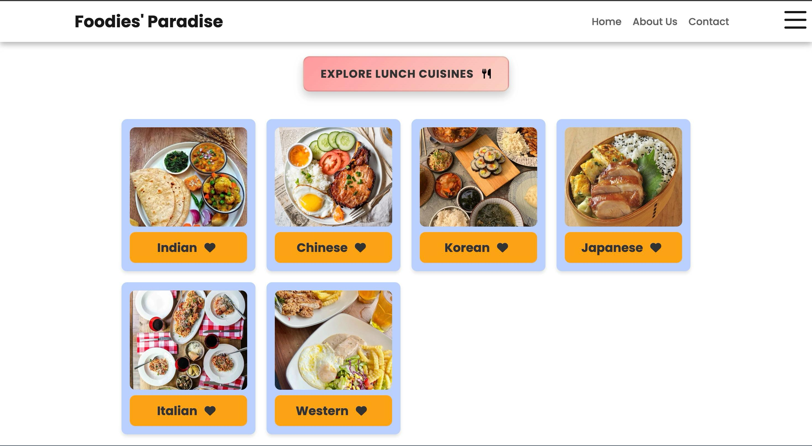
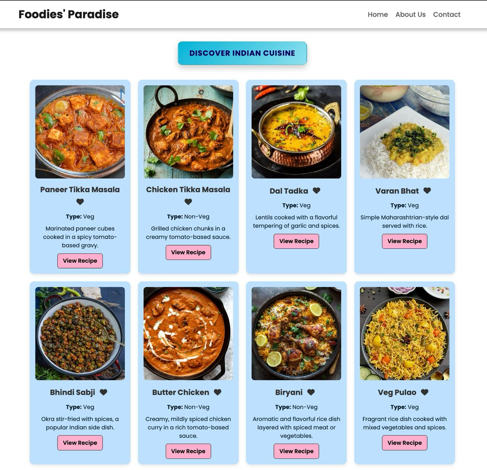
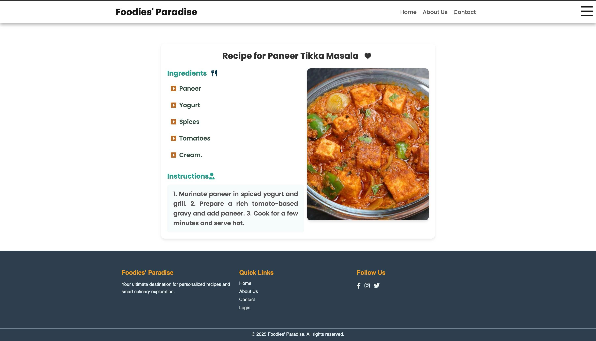
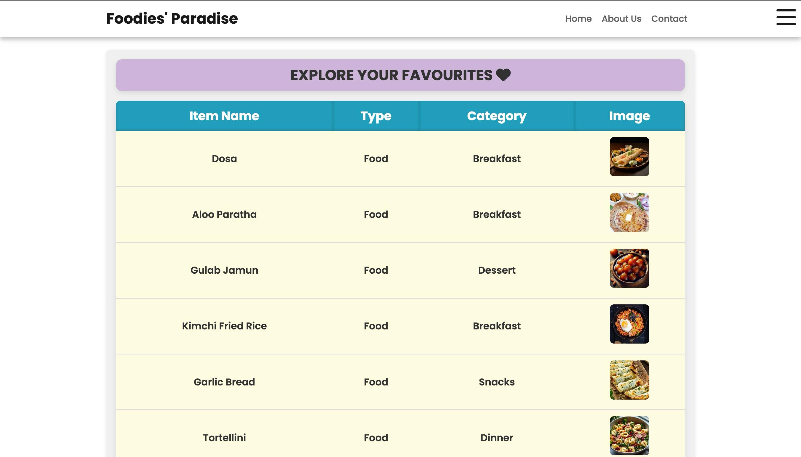
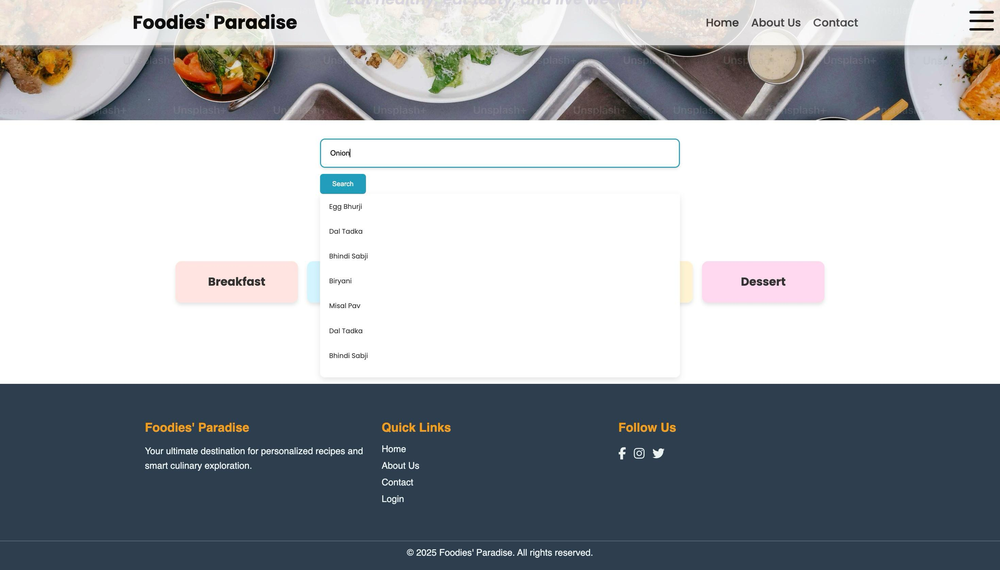

# 🍽️ Foodies' Paradise

**Your Ultimate Destination for Personalized Recipes and Smart Exploration**

Foodies' Paradise is a dynamic and interactive recipe website built using **HTML, CSS, JavaScript, MySQL, and Flask (Python)**. It helps users discover, like, and explore a wide variety of food recipes based on preferences, cuisines, and categories.

---

## 🚀 Features

- 🔍 **Smart Search Bar** – Find recipes by keywords, ingredients, or preferences.
- 🍱 **Category-wise Navigation** – Explore meals by category and cuisine.
- ❤️ **Liked List & Wishlist** – Save your favorite recipes and cuisines.
- 🔁 **Explore More Section** – Dynamic recipe recommendations.
- 🔐 **User Login & Registration** – Personalize and secure your experience.

---

## 📸 Screenshots

| Homepage | Categories |
|----------|------------|
|  |  |

| Cuisines Page | Food Items |
|---------------|------------|
|  |  |

| Recipe Card | Liked List |
|-------------|------------|
|  |  |

| Search Bar |
|--------|
|  |


---

## 🧱 Tech Stack

| Technology     | Purpose                             |
|----------------|-------------------------------------|
| HTML/CSS       | Frontend structure & styling        |
| JavaScript     | Interactivity and AJAX              |
| MySQL          | Backend database                    |
| Flask (Python) | Server and backend logic            |
| AJAX           | Smooth content loading without reloads |

---

## 📂 File Structure

```bash
FoodiesParadise/
├── static/
│   ├── css/
│   │   └── style.css
│   ├── js/
│   │   └── script.js
├── templates/
│   ├── base.html
│   ├── about.html
│   ├── index.html
│   ├── login.html
│   ├── register.html
│   ├── categories.html
│   ├── cuisine.html
│   ├── food_items.html
│   ├── recipe.html
│   └── liked_items.html
├── screenshots/
│   └── (all screenshots)
├── app.py
├── foodies.sql
├── Insert data/
│   ├── categories.sql
│   ├── cuisines.sql
│   ├── foode_items.sql
│   ├── recipes.sql
└── README.md
```
---

## 🧠 Database Schema Highlights

- **users**: Stores user accounts and preferences  
- **categories**, **cuisines**, **food_items**: Hierarchical recipe categorization  
- **recipes**: Contains full recipe content and metadata  
- **liked_items**, **wishlist**: Tracks user preferences and saved items

---

## 👥 Contributors

- **Vaishnavi Kokare** – Frontend, like/wishlist, ,session management, filtering logic
- **Chinmay Ghodake** – Backend, MySQL schema, search bar, login page

---

## ✨ Future Enhancements

- 📤 User-uploaded recipes with image upload
- 🧠 **AI Chatbot** – Suggests recipes based on ingredients you provide.
- 🤖 **AI Chatbot** – Suggests recipes based on ingredients you provide.
- 🥗 Nutrition tracking & dietary filters  
- 🔗 Social login & recipe sharing  

---

## 📄 License

This project is developed for **academic and educational purposes only**.

